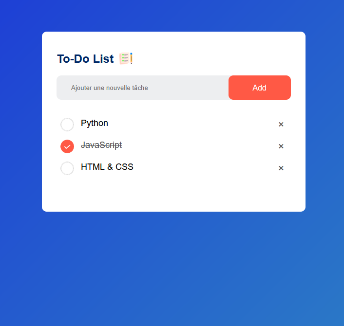

# ✅ Application To-Do List – HTML, CSS & JavaScript

Ce projet présente une application **To-Do List** interactive, permettant à un utilisateur de créer, supprimer et gérer ses tâches quotidiennes. L’objectif est de pratiquer les bases de **JavaScript Vanilla** et la manipulation du DOM.

🔗 **Dépôt GitHub** : [To-Do-list](https://github.com/JWulfran/To-Do-list.git)

---

## 🎯 Objectifs du projet

- Créer une application de liste de tâches fonctionnelle
- Appliquer les fondamentaux du **JavaScript** :
  - Ajout et suppression dynamique d’éléments
  - Gestion des événements utilisateur
- Offrir une **interface intuitive et responsive**

---

## 🛠️ Technologies utilisées

- **HTML5** : structure de la page
- **CSS3** : mise en forme simple et responsive
- **JavaScript Vanilla** : logique de gestion des tâches (sans framework)

---

## ⚙️ Fonctionnalités

- ✅ Ajouter une tâche
- 🗑️ Supprimer une tâche
- 📋 Marquer une tâche comme terminée
- 🧹 Réinitialiser la liste
- 💾 (optionnel) Stockage dans le navigateur via **localStorage**

---

## 📷 Aperçu visuel _(à ajouter)_

> 

---

## 🧠 Ce que j’ai appris

- Manipuler le DOM avec JavaScript
- Gérer les événements (`click`, `submit`, etc.)
- Structurer un petit projet web modulaire
- Créer une interface utilisateur simple mais fonctionnelle

---

📂 _Ce projet fait partie de mon portfolio front-end. Il illustre ma capacité à créer des interfaces interactives et dynamiques sans librairie externe._
